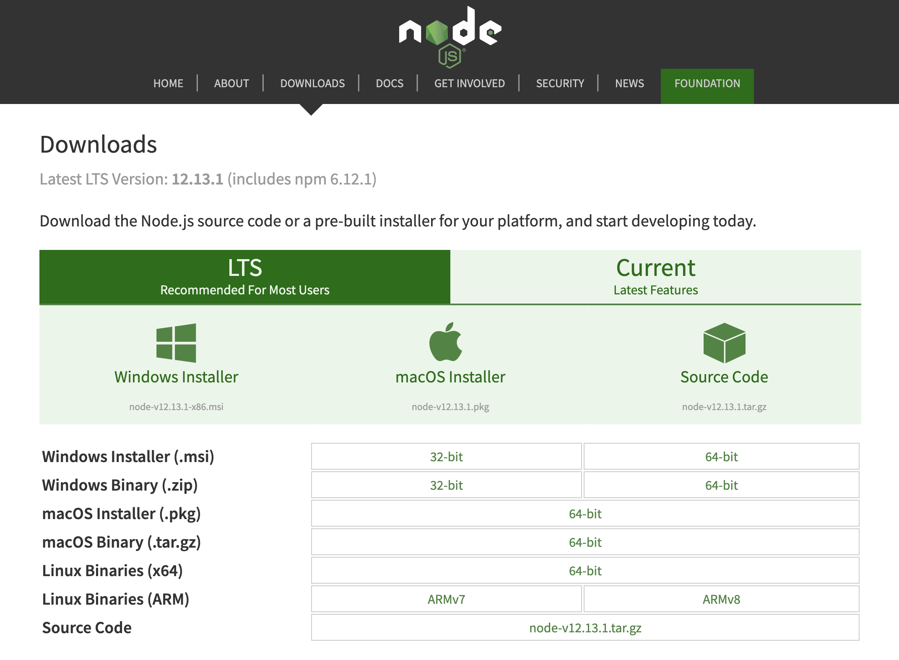

# 環境安裝

## 安裝 Node

- 安裝 LTS(Long Term Support) 版本
- <https://nodejs.org/en/download/>



確定環境安裝完成

```
node -v
npm -v
```

## 安裝 Visual Studio Code

- 下載 Visual Studio Code 安裝檔：<https://code.visualstudio.com/Download>


## 延伸閱讀

- [How to Install Node JS in Windows 10 - YouTube](https://www.youtube.com/watch?v=gHuIKptS0Qg)
