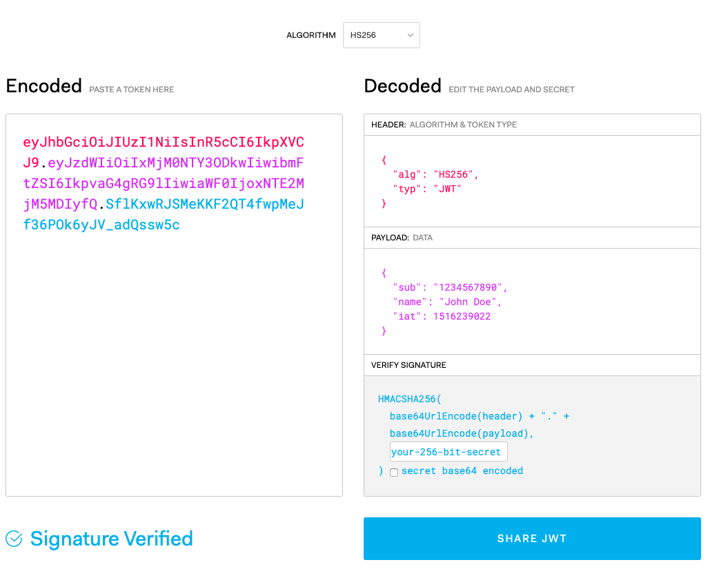

# JWT (JSON Web Token)

<https://jwt.io/>

**JWT 是什麼？**

> JSON Web Token (JWT) is a compact URL-safe means of representing claims to be transferred between two parties. The claims in a JWT are encoded as a JSON object that is digitally signed using JSON Web Signature (JWS).

- RFC7519 https://tools.ietf.org/html/rfc7519

JWT 是一個 Web Token，可以攜帶 JSON 格式的資料替兩方傳輸資料，攜帶的資料是使用數位簽證 JWS 加密過。

> The suggested pronunciation of JWT is the same as the English word
> "jot".

建議發音念 jot



[JSON Web Tokens - jwt.io](https://jwt.io/)

**結構可分為三個部分**

- 表頭 (Headers)
- 附加資料 (Claims / Payload)
- 簽證 (Signature)

**優點**

- JSON 格式通用性高
- payload 機制可以附帶一些非敏感訊息的資料
- 佔的空間很小，容易傳輸。
- 安全性佳
- 因為不是 Session 的機制，不會有 Loading Balancer 的瓶頸。

**缺點**

- Token 有長度限制

### 使用情境

- 任何需要 Token 機制的地方
  - 限制軟體授權時間
  - 裝置綁定
    - 第一次登入帳密 + UUID
    - 認證信 + UUID
  - 登入
  - 忘記密碼通知信
  - 認證信功能
- 需要支援無狀態 (stateless) 的分散式 API

### 實作方式

- 在 Server 確認過 Client 身份後，發一組 JWT 格式的 Token 給 Client，下次 Client 要在跟 Server 要資料的時候，就只要將 Token 放在 request header 中，Server 驗證 Token 後就可以確認身份。

```
Authorization: Bearer <token>
```

### 注意事項

- 保護好私鑰
- 盡量使用 HTTPS 傳遞資料
- 不要將敏感訊息附加在 payload 中

1. 在沒有 JWT 前的做法是？

### 範例

```
npm i koa -S
npm i koa-jwt -S
node app.js
```

#### app.js 檔

```js
const Koa = require('koa')
const jwt = require('koa-jwt')

const app = new Koa()
const hostname = '127.0.0.1'
const port = 3000

app.use(jwt({ secret: 'shared-secret' }).unless({ path: [/^\/public/] }))

app.use(function(ctx, next) {
  if (ctx.url.match(/^\/public/)) {
    ctx.body = 'unprotected\n'
  } else {
    return next()
  }
})

app.use(function(ctx) {
  if (ctx.url.match(/^\/api/)) {
    ctx.body = 'protected\n'
  }
})

app.listen(port, hostname, () => console.log(`Example app listening on port ${port}!`))
```

**延伸閱讀**

- [JSON Web Token - Wikipedia](https://en.wikipedia.org/wiki/JSON_Web_Token)
- [JSON Web Tokens - jwt.io](https://jwt.io/)
- [Online JWT Builder - Jamie Kurtz](http://jwtbuilder.jamiekurtz.com/)
- [Base64 Decode and Encode - Online](https://www.base64decode.org/)

### 延伸閱讀

- [JSON Web Token](https://en.wikipedia.org/wiki/JSON_Web_Token)
- [What are JSON Web Tokens? JWT Auth Explained [Tutorial] - YouTube](https://www.youtube.com/watch?v=x5gLL8-M9Fo)
