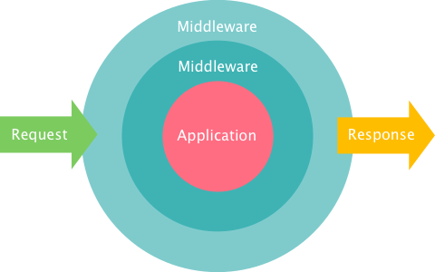

# 中間層 (Middleware)



## 常用中間層

<https://github.com/koajs/koa/wiki#middleware>

- [@koa/cors](https://github.com/koajs/cors)
- [koa-helmet](https://www.npmjs.com/package/koa-helmet)
- [koa-logger](https://www.npmjs.com/package/koa-logger)
- [koa-basic-auth](https://www.npmjs.com/package/koa-basic-auth)
- [koa-static](https://www.npmjs.com/package/koa-static)
- [koa-joi-router](https://www.npmjs.com/package/koa-joi-router)
- [koa-bodyparser](https://www.npmjs.com/package/koa-bodyparser)
- [koa-compose](https://www.npmjs.com/package/koa-compose)
- [koa-views](https://www.npmjs.com/package/koa-views)
- [koa-jwt](https://www.npmjs.com/package/koa-jwt)

**語法**

```
app.use(function)
```

Add the given middleware function to this application. See Middleware for more information.
