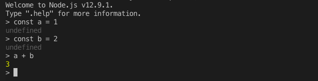

# 執行 JS

### REPL (Read Eval Print Loop)

```
node
```



```
Welcome to Node.js v12.9.1.
Type ".help" for more information.
> .help
.break    Sometimes you get stuck, this gets you out
.clear    Alias for .break
.editor   Enter editor mode
.exit     Exit the repl
.help     Print this help message
.load     Load JS from a file into the REPL session
.save     Save all evaluated commands in this REPL session to a file

Press ^C to abort current expression, ^D to exit the repl
>
```

### 執行檔案

hello.js

```js
console.log('Hello World')
```

執行 hello.js 檔案

```sh
node hello.js
```
