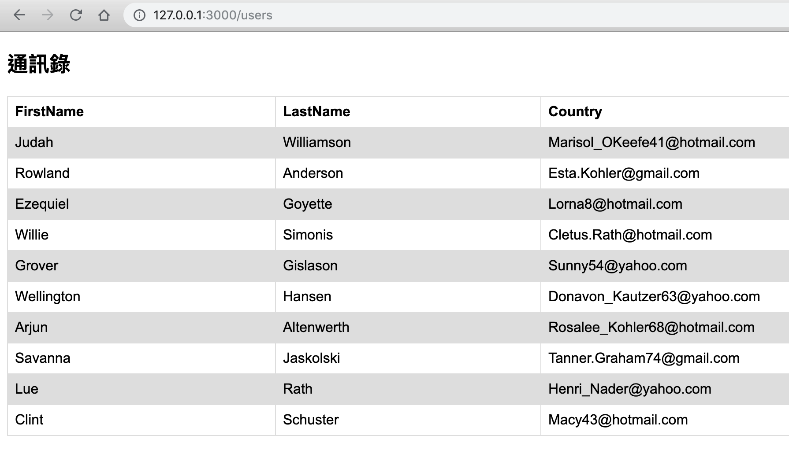

# 第三週 - 練習題

## 針對資料庫操作，對 User 做新增、刪除、修改、查詢

[解答](https://github.com/alincode/2019-fcu-backend-dev/tree/master/practice/class5/sequelize-demo)

## 用 html 的方式，列出所有 User

<http://127.0.0.1:3000/users>

[解答](https://github.com/alincode/2019-fcu-backend-dev/tree/master/practice/class6/hbs-demo)
