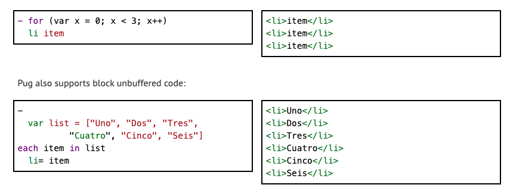

# 樣板系統 (templates)

- <https://www.npmjs.com/package/koa-views>

## pug

舊名叫 `jade`

<https://pugjs.org/api/getting-started.html>

```
html
  head
    title My Site - #{title}
    block scripts
      script(src='/jquery.js')
  body
    block content
    block foot
      #footer
        p some footer content
```



## EJS (Embedded JavaScript templating)

<https://ejs.co/>

```js
<% if (user) { %>
  <h2><%= user.name %></h2>
<% } %>
```

## handlebars.js

<https://handlebarsjs.com/>
